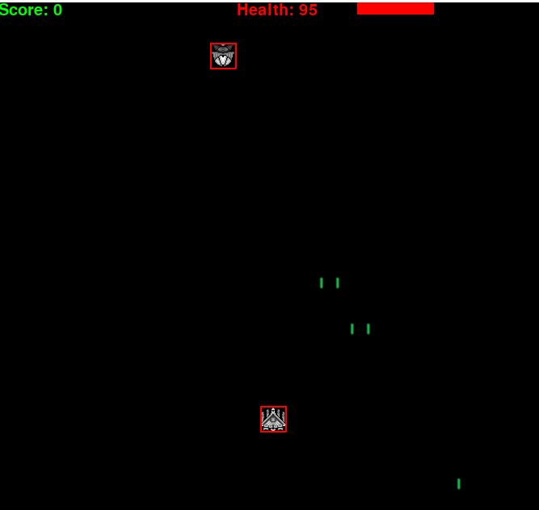

# Python-SpaceInvaders
This project is my version of Space Invaders using Python. I have added a few new features such as toggling through different weapons, having a variety of different enemies, not having barriers but having a health bar instead, and I am also thinking of adding multiplayer play as well.

Here is a basic visualization of the game play screen.

Here is what the default player ship looks like

Along with the current weapon, which takes one shot to eliminate most enemies.

Here are some of the enemies

**Basic Enemy** 

Basic Enemies can move horizontally or vertically up to a certain limit, and then they change direction.

